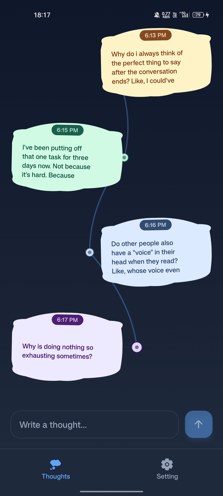
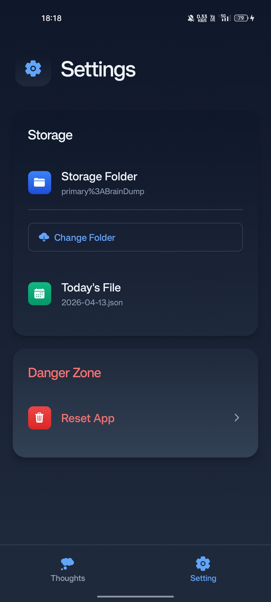
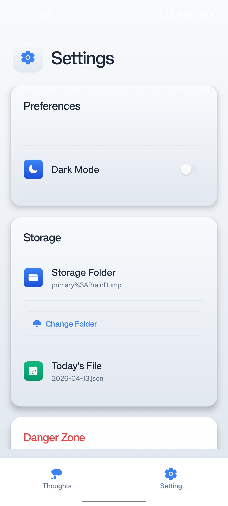
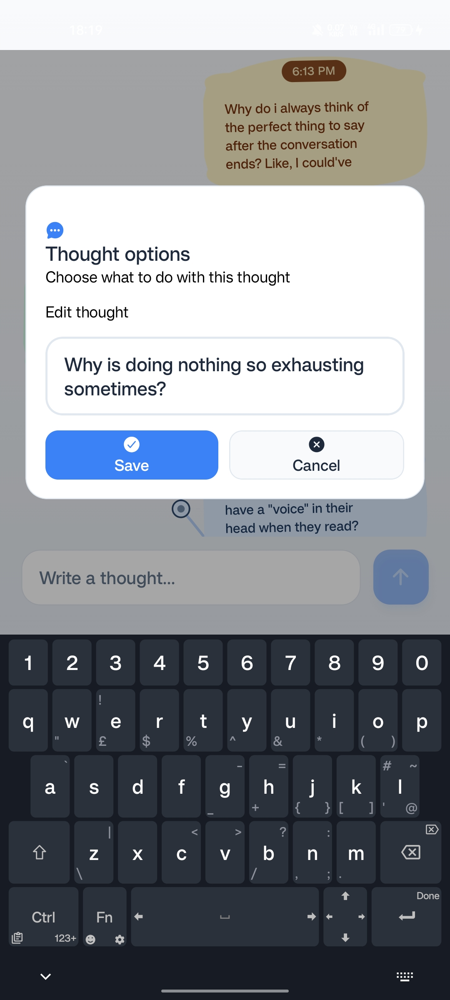

# 🧠 The Brain Dump

A lightweight, privacy-first daily thought journaling app. Store your thoughts locally on your device—no cloud, no tracking, just reflection.

## ✨ Features

**Daily Thought Journal** - Capture and organize your daily thoughts
**Local Storage Only** - All data stored as JSON files on your device
**Auto Day-Rollover** - New file automatically created each day at midnight
**Beautiful Timeline UI** - Visualize thoughts in an interactive timeline with thought bubbles
**Edit & Delete** - Manage your thoughts with a clean modal interface
**Dark Mode** - Eye-friendly dark theme with smooth gradients
**Zero Dependencies** - No cloud services, no external servers

## 📸 Screenshots






## 🚀 Installation

### Download APK
[Download the latest APK](https://expo.dev/accounts/alokxcode/projects/the_braindump/builds/00b494a0-b0fe-4644-a0fd-65a1106605ff)

### Development Setup

```bash
# Install dependencies
npm install

# Start dev server
npx expo start

# Run on Android or iOS
# Press 'a' for Android, 'i' for iOS
```

## 💾 How It Works

- Thoughts are stored as daily JSON files: `YYYY-MM-DD.json`
- Files saved in your selected folder or app-internal storage
- Each thought includes: unique ID, text, and creation timestamp
- Auto-detects day changes and creates new files at midnight

## 📸 Screenshots

✅ 100% local storage
✅ No cloud sync or accounts required
✅ No tracking or analytics
✅ Complete data control

## 📚 Tech Stack

- React Native + Expo Router
- TypeScript
- Expo File System API
- AsyncStorage
- React Native SVG

## 📝 License

MIT
  
</div>

## 🏗️ Architecture

### Tech Stack
- **React Native** + Expo Router for cross-platform mobile development
- **TypeScript** for type-safe code
- **Expo File System API** for local file I/O
- **AsyncStorage** for persisting folder selection
- **React Native SVG** for custom thought bubble visualizations
- **expo-av** for smooth notification feedback sounds

### Data Storage
- **Format**: Daily JSON files (`YYYY-MM-DD.json`)
- **Location**: User-selected folder or app-internal storage
- **Structure**:
  ```json
  [
    {
      "_id": "local_1681234567890_abc123def45",
      "text": "Your thought text here",
      "_creationTime": 1681234567890
    }
  ]
  ```

### Automatic Day Rollover
When the app detects it's a new day (at local midnight or app resume):
1. Current thoughts are preserved in yesterday's file
2. New empty day file is created
3. UI clears and displays new day's thoughts (initially empty)
4. All subsequent adds/edits go to today's file only

## 🚀 Getting Started

### Prerequisites
- Node.js (v18 or higher)
- npm or yarn
- Expo CLI (`npm install -g expo-cli`)
- Android Studio (for building Android APK) or Xcode (for iOS)

### Installation

1. **Clone and install dependencies**
   ```bash
   git clone <repo-url>
   cd the_braindump
   npm install
   ```

2. **Start development server**
   ```bash
   npx expo start
   ```

3. **Run on device or emulator**
   - Press `a` for Android emulator
   - Press `i` for iOS simulator
   - Scan QR code with Expo Go app on your phone

### Building APK for Android

```bash
# Install EAS CLI
npm install -g eas-cli

# Build preview APK
eas build -p android --profile preview

# Build production APK
eas build -p android
```

After build completes, download and install the APK on your Android device.

## 📁 Project Structure

```
the_braindump/
├── app/                      # Main app screens (Expo Router)
│   ├── _layout.tsx          # Root layout & theming
│   └── (tabs)/              # Tab navigation
│       ├── index.tsx        # Home/Timeline screen
│       └── setting.tsx      # Settings screen
├── components/              # Reusable UI components
│   ├── ThoughtInput.tsx     # Input field & send button
│   ├── ThoughtRoadTimeline.tsx # Timeline visualization (SVG bubbles)
│   ├── ThoughtItem.tsx      # Individual thought card
│   ├── ThoughtOptionsModal.tsx # Edit/Delete modal
│   ├── Header.tsx
│   ├── EmptyState.tsx
│   └── LoadingSpinner.tsx
├── hooks/                   # Custom React hooks
│   ├── useThoughts.tsx      # Main state hook
│   ├── useLocalStorage.tsx  # File I/O & storage logic
│   ├── useTheme.tsx         # Theme management (dark/light)
├── assets/                  # Images, icons, styles
│   └── images/
│       ├── icon.png         # App icon
│       └── app_images/      # Screenshots
├── convex/                  # (Removed) Backend functions were here
└── package.json             # Dependencies
```

## 🛠️ Key Components

### useLocalStorage Hook
Central file I/O orchestrator:
- `addThought(text)` - Add new thought, auto-save to file
- `updateThought(id, text)` - Edit existing thought
- `deleteThought(id)` - Remove thought
- `loadThoughtsFromFile()` - Read today's file on startup
- Auto-fallback to internal app storage if external storage fails
- Automatic day-rollover detection and handling

### ThoughtRoadTimeline
Visual timeline with:
- SVG-rendered thought bubbles with curved node connectors
- Automatic scroll to latest thought on add
- Time stamps with AM/PM indicators
- Tap-to-edit functionality

## 💾 Local Storage Details

### Internal App Storage (Fallback)
- **iOS**: `Documents/braindump_thoughts/`
- **Android**: `FilesDir/braindump_thoughts/` or `/data/data/com.anonymous.the_braindump/files/braindump_thoughts/`

### External Storage (Android)
- Uses **Storage Access Framework (SAF)** on Android 11+
- User selects folder via system file picker
- All thoughts stored as `YYYY-MM-DD.json` in selected folder

### Persistence
- Folder location persisted in AsyncStorage under key `braindump_storage_folder`
- If saved SAF URI becomes inaccessible (app reinstall, permission revoke), auto-fallback to internal storage

## 🔒 Privacy

✅ **100% Local Storage** - All data lives on your device  
✅ **No Cloud Sync** - No servers, no accounts, no tracking  
✅ **No Permissions Required** (except file access on Android for external storage option)  
✅ **No Analytics** - We don't collect any user data  

## 🐛 Troubleshooting

### Thoughts not saving?
- Check if you have write permissions for selected folder
- App will auto-fallback to internal storage if external fails
- Check console logs for "SAF folder save failed, falling back to internal app storage"

### Folder permission lost after app update?
- Open Settings screen and reselect folder
- App will validate access and proceed, or auto-fallback

### Midnight rollover not working?
- Ensure device clock is correct
- App checks rollover on: app resume, 60-second interval, and before each operation
- If still not working, kill and restart app at midnight

## 📝 Development

### Run in dev mode
```bash
npm run start
```

### Check for TypeScript errors
```bash
npx tsc --noEmit
```

### Format code
```bash
npx prettier --write .
```

## 📦 Dependencies

Key packages:
- `expo` - Framework
- `expo-router` - File-based routing
- `expo-file-system` - File I/O
- `@react-native-async-storage/async-storage` - Persistent key-value storage
- `react-native-svg` - SVG rendering for custom UI
- `expo-av` - Audio for feedback sounds
- `expo-linear-gradient` - Beautiful gradient backgrounds

## 🎨 Customization

### Theme Colors
Edit `hooks/useTheme.tsx` to customize:
- Primary/secondary colors
- Gradient backgrounds
- Text colors for dark/light mode

### Thought Bubble Design
Edit `components/ThoughtRoadTimeline.tsx` to modify:
- Bubble size and shape
- Connector line curves
- Timeline spacing

## 🚦 License

MIT - Feel free to use, modify, and distribute.

## 🤝 Contributing

Found a bug? Want to add a feature? Open an issue or submit a PR!

---

**Made with 💭 by the Brain Dump team**
